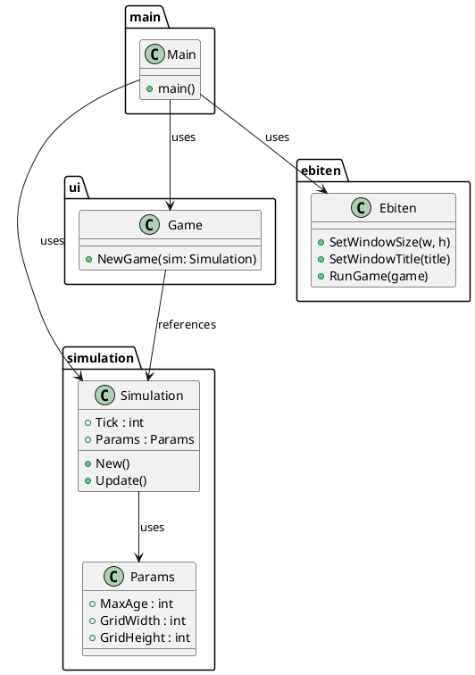
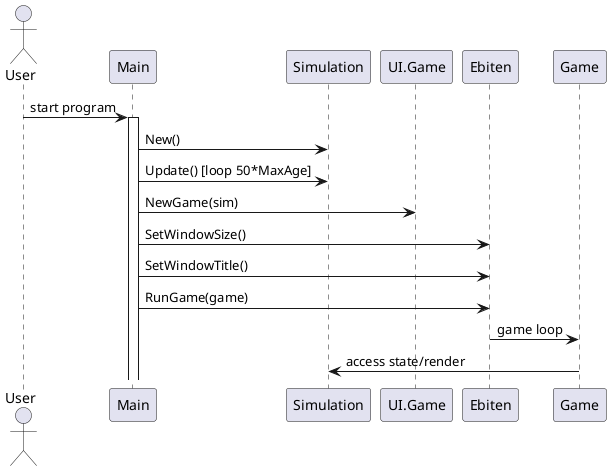
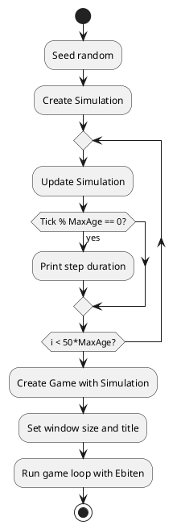

# Genetic Simulation - Diagrams and Flow

This document provides PlantUML diagrams to illustrate the structure and operation of the main components in the genetic simulation program.

---

## 1. Component/Class Diagram

---

## 2. Sequence Diagram

---

## 3. Process Flow Chart

---

**Summary:**
- The program seeds randomness, creates a simulation, runs updates for a set number of steps, then creates a UI game and starts the Ebiten game loop for visualization.
- The diagrams above illustrate the relationships, runtime sequence, and process flow.
