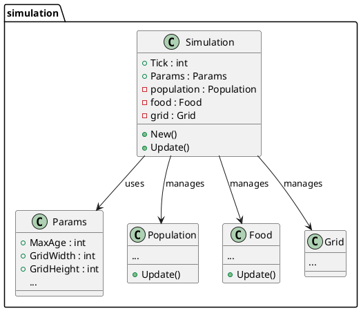
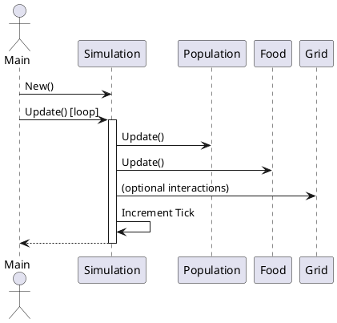
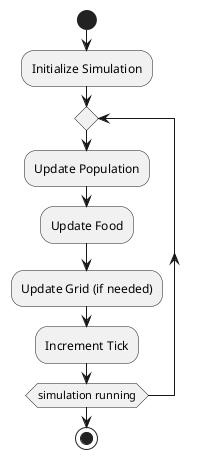

# Simulation Module - Structure and Operation

This document reviews the simulation portion of the codebase, providing PlantUML diagrams and a narrative explanation of its design and operation.

---

## Overview

The simulation module is responsible for modeling the core logic of the genetic simulation. It manages the state of the simulation, updates entities (such as creatures, food, and environment), and provides parameters that control the simulation's behavior.

---

## 1. Component/Class Diagram

---

## 2. Sequence Diagram (Simulation Update)

---

## 3. Process Flow Chart (Simulation Step)

---

## Narrative Explanation

- **Simulation** is the central struct that manages the state and progression of the genetic simulation. It holds references to the population of creatures, food sources, and the environment grid.
- **Params** contains configuration values such as maximum age, grid size, and other tunable parameters.
- On each update step, the simulation:
  1. Updates the population (e.g., creatures move, eat, reproduce, or die).
  2. Updates food sources (e.g., food may be consumed or regenerated).
  3. Optionally updates the grid (e.g., environmental changes).
  4. Increments the simulation tick counter.
- The simulation is repeatedly updated in a loop, either for a fixed number of steps or until a stopping condition is met.

This modular design allows for clear separation of concerns and extensibility for future features.
